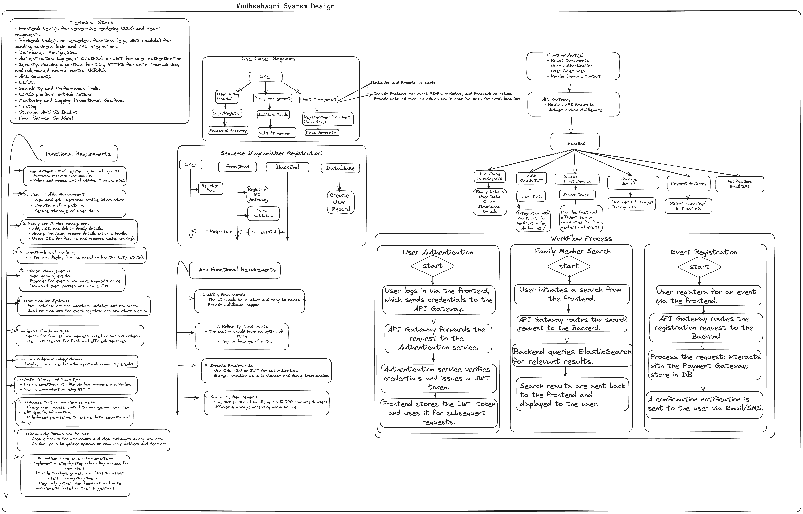

## Getting Started

First, run the development server:

```bash
yarn install # to install dependcies
```

```bash
yarn dev # to start server
```

Open [http://localhost:3000](http://localhost:3000) with your browser to see the result.

You can start editing the page by modifying `app/page.tsx`. The page auto-updates as you edit the file.

This project uses [`next/font`](https://nextjs.org/docs/basic-features/font-optimization) to automatically optimize and load Inter, a custom Google Font.

# System Design




## To contribute,

1. fork this repo

2. clone the repo you just forked

```bash
git clone https://github.com/path/to/your/repo #not actual command
```

3. Create the changes, internal comments explaining them are appreciated.
   add the changes along with the comments where you did ,what you did and what you changed.

4. commit and push

```bash
git add .
git commit -m "message"
git push origin main
```

5. create a pull request- go to your github and create a pull request.

6. Add necessary details, comments if any about the pull request.

7. Click on Create PR.
